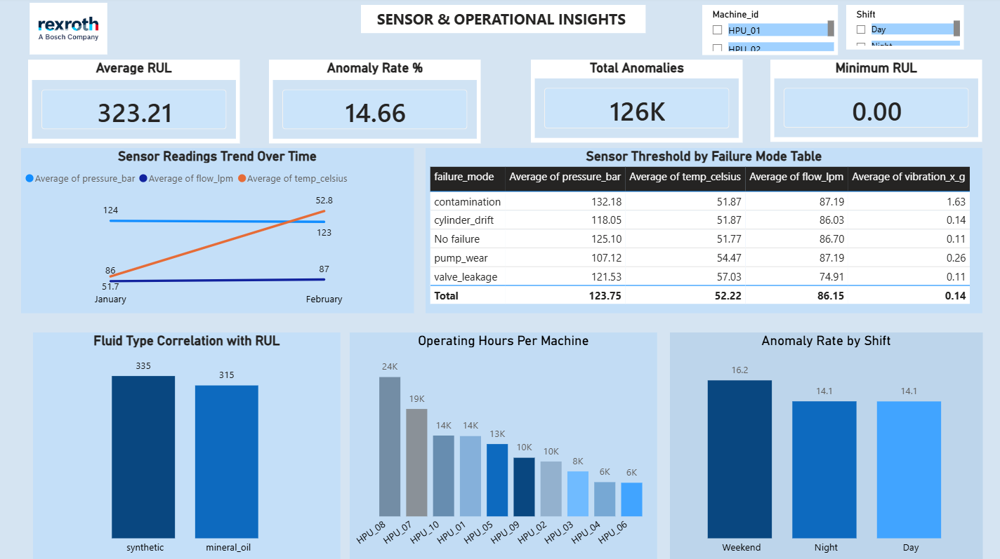
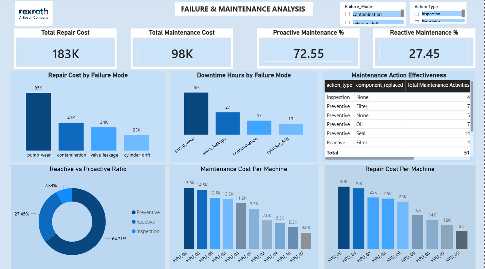
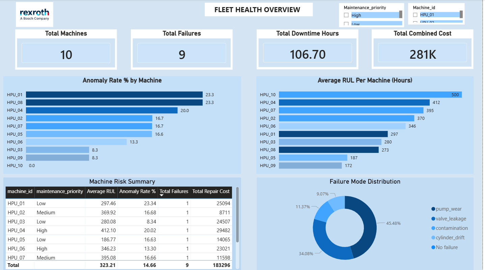

# 🔧 Bosch Rexroth AG — Predictive Maintenance for Hydraulic Systems


## 📌 Project Overview

This project presents a comprehensive **data analytics and predictive maintenance solution** for Bosch Rexroth AG, one of the world's leading suppliers of drive and control technologies. The goal is to transition the organisation from a **reactive maintenance culture** to a **data-driven, condition-based predictive maintenance strategy** for hydraulic systems.

The project was completed as part of a **3-week accelerated Agile/Scrum sprint** involving a cross-functional team of Data Analysts, Data Scientists, Business Analysts and a Project Manager.

---

## 🚨 Business Problem

Bosch Rexroth AG was experiencing significant financial and operational challenges due to unplanned hydraulic system failures:

- **$50,000** average cost per single unplanned failure event
- **$2M+** annual exposure per plant from 4 to 6 baseline failure events
- **68%** blindspot rate — failures occurring without any detectable warning in manual logs
- No existing system to forecast failures or estimate Remaining Useful Life (RUL)
- Heavy reliance on reactive maintenance leading to inefficient use of technician time

---

## 🎯 Project Objectives

- Perform full **Exploratory Data Analysis (EDA)** on multi-sensor hydraulic system data
- Build an interactive **Power BI dashboard** for real-time fleet health monitoring
- Identify **failure patterns, sensor thresholds and machine risk classifications**
- Support the Data Science team with clean, validated data for **ML model development**
- Provide actionable insights to reduce downtime and maintenance costs

---

## 🛠️ Tools & Technologies

| Tool | Purpose |
|------|---------|
| **PostgreSQL** | Data storage, cleaning, EDA queries and view creation |
| **Power BI** | Interactive dashboard and data visualisation |
| **Python (Matplotlib, Seaborn)** | EDA chart generation for reports |
| **Microsoft Word** | EDA report documentation |
| **PowerPoint** | Stakeholder presentation |
| **GitHub** | Version control and project documentation |

---

## 📂 Dataset Overview

The analysis is based on **4 interconnected datasets** containing **864,000 rows** of sensor telemetry and operational data:

| Table | Rows | Description |
|-------|------|-------------|
| `equipment_master` | 10 | Reference data for 10 hydraulic machines |
| `sensor_telemetry` | 861,410 | Time-series readings from 12 sensor channels |
| `failure_labels` | 9 | Confirmed failure events with costs and downtime |
| `maintenance_log` | 51 | All maintenance activities with costs |

### Sensor Channels
`pressure_bar` | `temp_celsius` | `flow_lpm` | `vibration_x_g` | `vibration_y_g` | `pump_rpm`

---

## 🧹 Data Cleaning Summary

| Issue | Rows Affected | Root Cause | Action Taken |
|-------|--------------|------------|--------------|
| Sensor column nulls (6 columns) | 2,590 | Sensor dropout events | Rows deleted (0.30% of data) |
| Failure mode nulls | 737,280 | Normal operating periods | Filled with 'Normal' |
| All other columns | 0 | No issues found | No action required |

**Result:** Dataset reduced from 864,000 to **861,410 rows** with **100% data completeness**

---

## 📊 Key EDA Findings

### Failure Mode Distribution
| Failure Mode | Count | Percentage |
|-------------|-------|-----------|
| No Failure | 735,088 | 85.34% |
| Pump Wear | 57,451 | **6.67%** |
| Valve Leakage | 43,049 | 5.00% |
| Contamination | 14,362 | 1.67% |
| Cylinder Drift | 11,460 | 1.33% |

### Machine Risk Classification
| Risk Level | Machines | Avg RUL |
|-----------|---------|---------|
| 🔴 High Risk | HPU_09, HPU_05 | < 200 hours |
| 🟡 Medium Risk | HPU_08, HPU_03, HPU_01, HPU_06 | 200–350 hours |
| 🟢 Low Risk | HPU_02, HPU_07, HPU_04, HPU_10 | > 350 hours |

### Financial Impact
- **Total Repair Cost:** $183,296
- **Total Maintenance Cost:** $97,002
- **Total Combined Cost:** $280,298
- **Total Downtime:** 106.70 hours
- **Most Expensive Failure:** Pump Wear — $84,912 (46.3% of all repair costs)

### Maintenance Ratio
| Category | Current | Target | Status |
|---------|---------|--------|--------|
| Proactive | 72.55% | 80% | ⚠️ Below Target |
| Reactive | 27.45% | 20% | ⚠️ Above Target |

---

## 🚨 Sensor Alert Thresholds

| Sensor | Warning Threshold | Failure Mode |
|--------|------------------|-------------|
| Pressure | < 110 bar | Pump Wear |
| Temperature | > 57°C | Pump Wear / Valve Leakage |
| Vibration X | > 0.20g | Pump Wear |
| Vibration X | > 1.0g | Contamination |
| Flow | < 80 lpm | Valve Leakage |

---

## 📈 Power BI Dashboard

The interactive dashboard consists of **3 pages** built on PostgreSQL views:

### Page 1 — Fleet Health Overview


### Page 2 — Failure & Maintenance Analysis


### Page 3 — Sensor & Operational Insights


---

## 🗄️ SQL Queries

All SQL queries are organised in the `/sql` folder:

| File | Description |
|------|-------------|
| `01_data_cleaning.sql` | Missing value profiling and sensor dropout investigation |
| `02_eda_queries.sql` | Full EDA analysis including failure distribution, anomaly rates and RUL |
| `03_business_queries.sql` | Business KPI queries including maintenance ratio and fluid correlation |
| `04_views.sql` | PostgreSQL views created for Power BI connection |
| `05_primary_foreign_keys.sql` | Primary and foreign key definitions for ERD |

---

## 💡 Key Insights & Recommendations

1. **Immediate Action** — Schedule urgent maintenance for HPU_09 (RUL: 171.84 hrs) and HPU_05 (RUL: 186.77 hrs)
2. **Priority Realignment** — Upgrade HPU_01, HPU_05 and HPU_09 from Low/Medium to High priority
3. **Fluid Type Strategy** — Consider transitioning mineral oil machines to synthetic fluid for 6.2% higher RUL
4. **Proactive Maintenance** — Convert 4 reactive activities to preventive maintenance to reach 80% KPI target
5. **Asset Review** — Evaluate HPU_08 (24,309 operating hours) for replacement vs continued maintenance
6. **Sensor Alerts** — Implement automated threshold alerts for 5 to 14 day advance failure warning

---

## 📁 Repository Structure

```
bosch-rexroth-predictive-maintenance/
│
├── README.md
│
├── dashboard/
│   ├── fleet_health_overview.png
│   ├── failure_maintenance_analysis.png
│   └── sensor_operational_insights.png
│
├── sql/
│   ├── 01_data_cleaning.sql
│   ├── 02_eda_queries.sql
│   ├── 03_business_queries.sql
│   ├── 04_views.sql
│   └── 05_primary_foreign_keys.sql
│
├── reports/
│   ├── EDA_Report.docx
│   └── EDA_Presentation.pptx
│
└── docs/
    ├── Project_Charter.pdf
    └── Business_Questions_KPIs.pdf
```

---

## 👥 Project Team

| Role | Responsibility |
|------|---------------|
| Data Analyst | EDA, data cleaning, Power BI dashboard, reports |
| Data Scientist | ML model development, RUL regression, deployment |
| Business Analyst | KPI definition, CMMS workflow mapping |
| Project Manager | Sprint tracking, stakeholder demos, timeline governance |

---

## 🏢 About Bosch Rexroth AG

Bosch Rexroth AG is a global leader in drive and control technologies, providing advanced solutions for industrial automation and hydraulic systems. This project supports their strategic transition to an **Industry 4.0 data-driven maintenance framework**.

---

## 📧 Contact

[Feel free to connect with me on LinkedIn or reach out for any questions about this project.](https://www.linkedin.com/in/adewoye-oluwatimilehin/)

---

*This project was completed as part of a 3-week accelerated data analytics sprint using Agile/Scrum methodology.*
